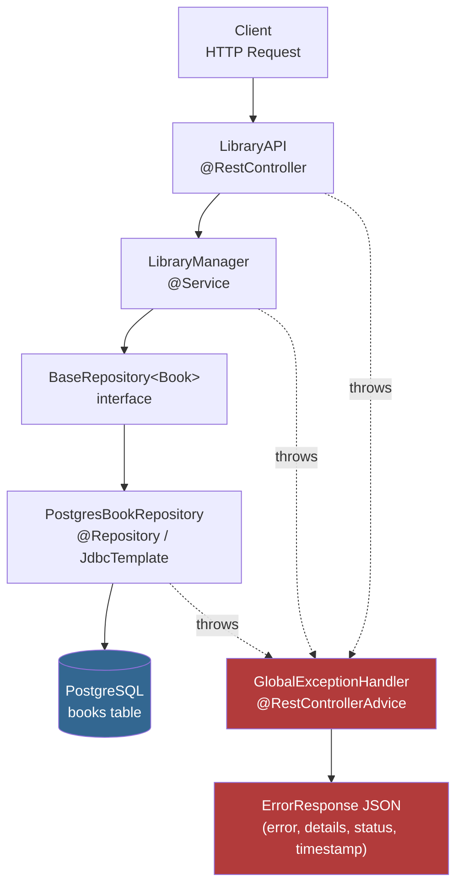
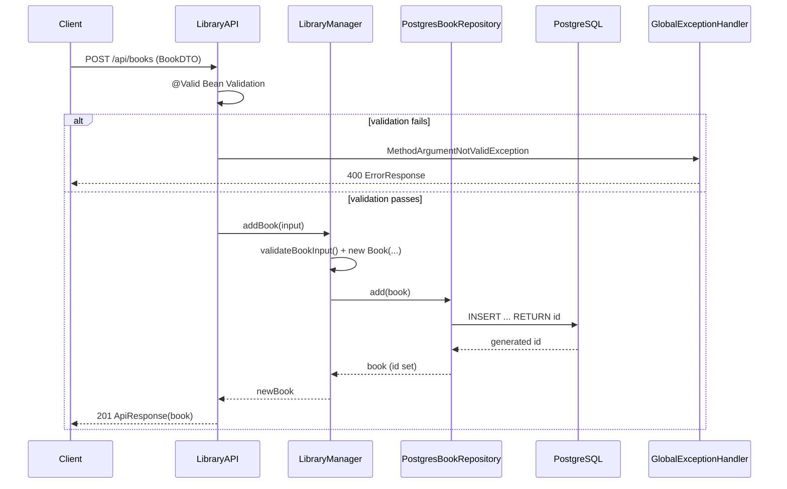

# Library API System


A Spring Boot REST API for managing a book library, backed by PostgreSQL. It exposes CRUD endpoints plus search, budget filtering, sorting, and aggregate statistics, with centralized validation and error handling.

* [Architecture Overview](https://github.com/kyledelfin2006/library-api-system#architecture-overview)
* [File Structure](https://github.com/kyledelfin2006/library-api-system#file-structure)
* [Core Design Patterns](https://github.com/kyledelfin2006/library-api-system#core-design-patterns)
* [Key Features](https://github.com/kyledelfin2006/library-api-system#key-features)
* [Workflow & Lifecycle](https://github.com/kyledelfin2006/library-api-system#workflow--lifecycle)
* [Code Highlights](https://github.com/kyledelfin2006/library-api-system#code-highlights)
* [Setup & Installation](https://github.com/kyledelfin2006/library-api-system#setup--installation)
* [Troubleshooting](https://github.com/kyledelfin2006/library-api-system#troubleshooting)
* [Data Management](https://github.com/kyledelfin2006/library-api-system#data-management)
* [Upcoming Improvements](https://github.com/kyledelfin2006/library-api-system#upcoming-improvements)
* [License](https://github.com/kyledelfin2006/library-api-system#license)

---

## Architecture Overview

The system is a layered Spring Boot application: an HTTP layer (`@RestController`) delegates to a business layer (`LibraryManager`), which depends only on a repository **interface** (`BaseRepository<T>`), currently backed by a PostgreSQL implementation using Spring's `JdbcTemplate` (raw SQL, not JPA entities). Cross-cutting concerns — validation errors, missing resources, malformed requests — are funneled through a single `@RestControllerAdvice` so every failure returns the same JSON error shape.



Plain-text equivalent, for environments that don't render Mermaid:
```
HTTP Request
    │
    ▼
LibraryAPI (@RestController)   ── maps routes, extracts params, wraps responses
    │
    ▼
LibraryManager (@Service)       ── business rules, search/sort/stat logic, validation
    │
    ▼
BaseRepository<Book> (interface)
    │
    ▼
PostgresBookRepository (@Repository) ── JdbcTemplate + raw SQL against `books` table
    │
    ▼
PostgreSQL (Docker container, schema.sql applied on init)
```

Errors thrown anywhere in that chain (`IllegalArgumentException`, `BookNotFoundException`, JSON parsing failures, unmapped routes, SQL errors, anything else) are intercepted by `GlobalExceptionHandler` and converted into a consistent `ErrorResponse` JSON body with a status code.

---

## File Structure

```
src/
  main/
    java/
      api/
        controller/
          LibraryAPI.java            # REST endpoints
        exceptions/
          BookNotFoundException.java # 404 domain exception
          GlobalExceptionHandler.java# centralized error handling
        manager/
          LibraryManager.java        # business logic / orchestration
        models/
          Book.java                  # domain entity (self-validating)
          BookDTO.java                # request payload (Bean Validation annotations)
        repository/
          BaseRepository.java        # generic persistence contract
          PostgresBookRepository.java# JdbcTemplate-backed implementation
        responses/
          ApiResponse.java           # generic success envelope
          ErrorResponse.java         # generic error envelope
        LibraryApplication.java      # Spring Boot entry point
    resources/
      schema.sql                    # `books` table DDL, applied at startup
  test/
    java/
      testAPI/
        BookTest.java                # Book self-validation unit tests
        LibraryManagerTest.java      # Mockito-based service-layer tests
.gitignore
application.properties              # datasource config (env-var driven)
docker-compose.yml                  # app + postgres services
Dockerfile                          # runs the pre-built jar
envFileExample                      # sample .env for docker-compose
pom.xml                             # Maven build, Spring Boot 4.1.0 parent
README.md
```

---

## Core Design Patterns

* **Layered architecture (Controller → Service → Repository).** `LibraryAPI` never touches persistence directly; it only calls `LibraryManager`, which is the sole owner of business rules.
* **Dependency Inversion via `BaseRepository<T>`.** `LibraryManager` is constructed with `BaseRepository<Book>`, an interface, not the concrete `PostgresBookRepository`. This is what makes `LibraryManagerTest` possible without a real database — a Mockito mock of the interface stands in for it.
* **Generic repository contract.** `BaseRepository<T>` (`add`, `remove`, `getAll`, `clear`, `addAll`) is type-parameterized, so a future entity type could reuse the same contract shape.
* **DTO / domain separation.** `BookDTO` (annotated with `@NotBlank`, `@Size`, `@Positive`) is the wire format for create/patch requests; `Book` is the internal domain model with its own defensive validation in the constructor. Neither trusts the other's validation exclusively.
* **Centralized exception translation (`@RestControllerAdvice`).** Every exception type the app expects to encounter — bad input, malformed JSON, missing route, wrong verb, SQL failure, not-found, or anything uncaught — has a dedicated `@ExceptionHandler` in `GlobalExceptionHandler`, so controllers stay free of try/catch blocks.
* **Uniform response envelopes.** `ApiResponse<T>` (success path) and `ErrorResponse` (failure path) both always carry a `timestamp`, giving every response a consistent, predictable JSON shape regardless of endpoint.
* **Key generation delegated to the database.** `Book` has no client- or app-generated ID; `PostgresBookRepository.add()` uses `GeneratedKeyHolder` to read back the `SERIAL` id Postgres assigns on insert, and sets it onto the `Book` object afterward.

---

## Key Features

* **Full CRUD** on books: create (`POST`), read (single/all), partial update (`PATCH`), delete (`DELETE`).
* **Search** by `author`, `title`, or `genre` (case-insensitive, partial/`contains` match) or by `price` (exact match within a `0.0001` tolerance to avoid floating-point equality issues).
* **Budget filtering** — return all books at or under a given `maxPrice`.
* **Sorting** by `title`, `author`, `genre`, `price`, or `id`; an unrecognized sort field returns an unsorted copy rather than erroring.
* **Library statistics** — total book count, total inventory value, and the single most expensive book.
* **Bean Validation on create** — `@Valid BookDTO` on `POST /api/books` enforces non-blank title/author/genre, length limits, and a strictly positive price before a `Book` is even constructed.
* **Defense-in-depth validation** — even though `BookDTO` is validated at the controller boundary, `Book`'s own constructor independently re-validates title/author/genre/price, and `LibraryManager.validateBookInput()` checks again before construction. The same field can be rejected for the same reason at up to three different layers.
* **Deliberately lenient PATCH** — `PATCH /api/books/{id}` accepts a plain `@RequestBody BookDTO` (no `@Valid`), so Bean Validation annotations are **not** enforced on updates. Instead, `LibraryManager.patchBook()` manually checks each field: blank/null string fields are silently skipped (left unchanged) rather than rejected, while a non-null price is still required to be `> 0`.
* **Consistent JSON error contract** across 400/404/405/500 responses via `ErrorResponse`.

---

## Workflow & Lifecycle



**Application startup**
1. `LibraryApplication.main()` boots the Spring context.
2. `spring.sql.init.mode=always` (in `application.properties`) causes Spring Boot to execute `src/main/resources/schema.sql` against the configured datasource, creating the `books` table if it doesn't already exist (`CREATE TABLE IF NOT EXISTS`).
3. `spring.jpa.hibernate.ddl-auto=none` — schema is managed exclusively by `schema.sql`, not Hibernate auto-DDL (this is true even though `spring-boot-starter-data-jpa` is on the classpath; no JPA entities or Hibernate schema generation are actually in play).
4. `PostgresBookRepository` and `LibraryManager` are instantiated and wired via constructor injection.

**Error path (example: unknown book ID)**
1. `LibraryManager.findBookById()` returns `null`.
2. The controller throws `BookNotFoundException`.
3. `GlobalExceptionHandler.handleBookNotFound()` logs a warning and returns `404` with an `ErrorResponse`.

**Shutdown** — no explicit shutdown hook exists in the current codebase; the JVM/Spring context simply terminates. Persistence is fully delegated to PostgreSQL on every write, so there's no flush-on-exit step to run.

---

## Code Highlights

**Generated keys read back from Postgres** (`PostgresBookRepository.add`):
```java
jdbcTemplate.update(connection -> {
    PreparedStatement ps = connection.prepareStatement(sql, Statement.RETURN_GENERATED_KEYS);
    ps.setString(1, book.getTitle());
    // ...
    return ps;
}, keyHolder);

Map<String, Object> keys = keyHolder.getKeys();
if (keys != null && keys.containsKey("id")) {
    book.setId(((Number) keys.get("id")).longValue());
}
```
This is the only place a `Book`'s `id` is ever assigned outside of tests — the constructor deliberately leaves `id` null.

**Tolerant floating-point price search** (`LibraryManager.bookMatches`):
```java
case "price":
    try {
        double priceValue = Double.parseDouble(value);
        return Math.abs(book.getPrice() - priceValue) < 0.0001;
    } catch (NumberFormatException e) {
        return false;
    }
```
Avoids the classic `==` pitfall with `double` comparisons, and fails closed (no match) on unparsable input rather than throwing.

**Partial update that intentionally skips full validation** (`LibraryManager.patchBook`):
```java
if (updates.getTitle() != null && !updates.getTitle().trim().isEmpty()) {
    existingBook.setTitle(updates.getTitle());
}
// ... same pattern for author/genre
if (updates.getPrice() != null) {
    if (updates.getPrice() <= 0) {
        throw new IllegalArgumentException("Price must be greater than 0");
    }
    existingBook.setPrice(updates.getPrice());
}
```
Each field is optional and independently validated only if present — this is what makes `PATCH` genuinely partial, in contrast to the all-or-nothing `@Valid` check on `POST`.

**Uniform error shape regardless of cause** (`GlobalExceptionHandler`):
```java
@ExceptionHandler(Exception.class)
public ResponseEntity<ErrorResponse> handleEverythingElse(Exception ex) {
    logger.error("Unexpected error occurred", ex);
    ErrorResponse error = new ErrorResponse("Internal server error", ex.getMessage(), 500);
    return ResponseEntity.status(HttpStatus.INTERNAL_SERVER_ERROR).body(error);
}
```
A catch-all sits below the more specific handlers (`BookNotFoundException`, `SQLException`, `MethodArgumentNotValidException`, etc.), guaranteeing no exception escapes as a raw stack trace or a non-JSON response.

**Concurrency-safety proven in tests, not in the repository itself** (`LibraryManagerTest.addBook_ConcurrentAdds_AllSucceed`):
```java
ExecutorService executor = Executors.newFixedThreadPool(threadCount);
for (BookDTO input : inputs) {
    futures.add(executor.submit(() -> manager.addBook(input)));
}
// ... verify(repository, times(threadCount)).add(any(Book.class));
```
This confirms `LibraryManager.addBook` behaves correctly under concurrent calls against a mocked repository; it does **not** by itself prove thread-safety of `PostgresBookRepository` against a real database (that safety, if any, comes from Postgres itself, not from application-level synchronization — there is no `synchronized` keyword anywhere in the current repository or manager code).

---

## Setup & Installation

### Prerequisites
* JDK 21+ (the `pom.xml` sets `maven.compiler.source`/`target` to `21`, while also declaring `<java.version>25</java.version>` — see [Troubleshooting](#troubleshooting))
* Maven
* Docker and Docker Compose (for running PostgreSQL, or the whole stack)

### Option A — Run everything with Docker Compose (Recommended)
1. Copy the example env file and fill in real values:
   ```bash
   cp envFileExample .env
   ```
   ```
   POSTGRES_DB=librarydb
   POSTGRES_USER=admin
   POSTGRES_PASSWORD=change_me
   ```
2. Build the jar first — the `Dockerfile` copies a pre-built artifact rather than building it inside the image:
   ```bash
   mvn clean package
   ```
3. Start both services:
   ```bash
   docker compose up --build
   ```
   This brings up a `postgres:15` container (with `schema.sql` mounted as an init script) and the app container, wired together via the `SPRING_DATASOURCE_*` environment variables that `docker-compose.yml` derives from your `.env`.
4. The API is available at `http://localhost:8080`, Postgres at `localhost:5432`.

### Option B — Run the app locally against a container-only database
1. Start only the database:
   ```bash
   docker compose up db
   ```
2. Export the datasource variables `application.properties` expects (it has **no defaults** — the app will fail to start without these):
   ```bash
   export SPRING_DATASOURCE_URL=jdbc:postgresql://localhost:5432/librarydb
   export SPRING_DATASOURCE_USERNAME=admin
   export SPRING_DATASOURCE_PASSWORD=change_me
   ```
3. Build and run:
   ```bash
   mvn clean install
   mvn spring-boot:run
   ```

### Quick smoke test
```bash
curl http://localhost:8080/api/health
# {"success":true,"message":"API is running","timestamp":...}
```

### API Endpoint Reference

| Method | Endpoint | Status Codes | Description |
|--------|----------|---------------|--------------|
| `GET` | `/api/health` | 200 | Liveness check |
| `GET` | `/api/books` | 200 | Get all books |
| `GET` | `/api/books/{id}` | 200, 404 | Get a single book by ID |
| `POST` | `/api/books` | 201, 400 | Add a new book (`@Valid`-checked body) |
| `PATCH` | `/api/books/{id}` | 200, 400, 404 | Partially update a book (no `@Valid`; manual field checks) |
| `DELETE` | `/api/books/{id}` | 200, 404 | Delete a book by ID |
| `GET` | `/api/books/search?type=&value=` | 200, 400 | Search by `author`, `title`, `genre`, or `price` |
| `GET` | `/api/books/budget?maxPrice=` | 200, 400 | Books at or below a given price |
| `GET` | `/api/books/sorted?by=` | 200 | Sort by `title`, `author`, `genre`, `price`, or `id` |
| `GET` | `/api/books/stats` | 200 | Total books, total value, most expensive book |

### Example requests
```bash
# Add a book
curl -X POST http://localhost:8080/api/books \
  -H "Content-Type: application/json" \
  -d '{"title":"1984","author":"Orwell","genre":"Fiction","price":15.99}'

# Partially update just the price (id is a Postgres-generated Long, e.g. 1)
curl -X PATCH http://localhost:8080/api/books/1 \
  -H "Content-Type: application/json" \
  -d '{"price":12.99}'

# Search by author (partial, case-insensitive)
curl "http://localhost:8080/api/books/search?type=author&value=Orwell"

# Books within budget
curl "http://localhost:8080/api/books/budget?maxPrice=20"

# Sorted by price
curl "http://localhost:8080/api/books/sorted?by=price"

# Library-wide stats
curl http://localhost:8080/api/books/stats
```

### Running the test suite
```bash
mvn test
```

**`BookTest`** — verifies `Book`'s self-validation: a valid book constructs with `id == null` (the ID is only assigned later, by the repository); empty title, null author, negative price, and zero price all throw `IllegalArgumentException`.

**`LibraryManagerTest`** — a Mockito-based suite (`@ExtendWith(MockitoExtension.class)`) mocking `BaseRepository<Book>` only (no storage layer to mock, since none exists), covering: concurrent adds via `ExecutorService` (asserting no exceptions and correct call counts), invalid-input rejection, get-all, find-by-id (existing/non-existing), delete (existing/non-existing), patch (field-level updates, price validation, non-existing ID), budget filtering, search across all four types, sorting across all five fields (including invalid-field fallback to an unsorted copy), total value calculation, most-expensive-book lookup, and a direct test of the `bookMatches` matching logic.

---

## Troubleshooting

| Symptom | Likely Cause | Resolution |
|---------|--------------|------------|
| App fails to start with a datasource/property-placeholder error | `SPRING_DATASOURCE_URL`/`USERNAME`/`PASSWORD` env vars aren't set — `application.properties` has no fallback defaults | Export all three variables, or supply them via `.env` + `docker-compose.yml` |
| `400 Bad Request` on `POST /api/books` even with a JSON body | A required field (`title`, `author`, `genre`) is blank, or `price` is missing/not positive | Check `ErrorResponse.details` — it lists every failing `@NotBlank`/`@Size`/`@Positive` constraint |
| `400 Bad Request` — "Invalid JSON format in request body" | Malformed JSON syntax, or missing `Content-Type: application/json` header | Validate the payload and confirm the header is set |
| `PATCH` silently ignores a field you sent | Blank/whitespace-only string fields (or a `null`) are treated as "no change" by design, not as an error | Send a non-blank value if you intend to update that field |
| Unmapped routes return a generic Spring error page instead of the expected JSON 404 | `NoHandlerFoundException` is only thrown (and thus only caught by `GlobalExceptionHandler`) if `spring.mvc.throw-exception-if-no-handler-found=true` and `spring.web.resources.add-mappings=false` are set — neither appears in the current `application.properties` | Add both properties if you want unmapped routes to return the app's standard `ErrorResponse` JSON instead of Spring Boot's default error page |
| `404 Not Found` on a valid-looking route | Typo in the path, or the resource ID doesn't exist | Compare against the [API Endpoint Reference](#setup--installation); `GET /api/books` first to confirm the ID exists |
| `405 Method Not Allowed` | Wrong HTTP verb for an endpoint (e.g., `PUT` instead of `PATCH`) | Check the supported-methods detail returned in the error body |
| `500 Internal Server Error` mentioning SQL | Connection failure, missing table, or constraint violation against Postgres | Confirm the `db` container is up, `schema.sql` ran, and the datasource env vars point at the right host/port |
| Search returns nothing when you expect matches | `type` isn't one of `author`, `title`, `genre`, `price`, or `value` has a typo | Text search is `contains`-based and case-insensitive; price search requires a parsable numeric value |
| `docker-compose up --build` fails to find the app jar | `Dockerfile` copies `target/*.jar` but does not build it — there's no Maven build stage in the image | Run `mvn clean package` locally before `docker-compose up --build` |
| Build fails on Java version mismatch | `pom.xml` declares `<java.version>25</java.version>` while `maven.compiler.source`/`target` are `21`, and a comment claims Spring Boot 3.4.x compatibility despite the parent POM being version `4.1.0` | Confirm your installed JDK satisfies both constraints, or align the properties/parent version to a single consistent, tested combination |
| Confusing references to `books.txt`, `BookStorage`, or `BookIDGenerator` in older documentation or comments | The project was previously built around flat-file persistence; it has since migrated to PostgreSQL via `JdbcTemplate`, and those classes no longer exist in the codebase | Treat any documentation describing flat-file storage as outdated — this README reflects the current Postgres-backed implementation |

---

## Data Management

**Storage backend.** All book data lives in a PostgreSQL `books` table — there is no flat-file or in-memory-only persistence in the current codebase.

**Schema** (`src/main/resources/schema.sql`):
```sql
CREATE TABLE IF NOT EXISTS books (
    id SERIAL PRIMARY KEY,
    title VARCHAR(255) NOT NULL,
    author VARCHAR(100) NOT NULL,
    genre VARCHAR(50) NOT NULL,
    price DECIMAL(10,2) NOT NULL
);
```

**Schema application.** `spring.sql.init.mode=always` runs `schema.sql` on every application startup; `spring.jpa.hibernate.ddl-auto=none` ensures Hibernate never attempts its own schema generation, even though `spring-boot-starter-data-jpa` is a declared dependency.

**How IDs are assigned.** Postgres generates the `id` via the `SERIAL` column. `PostgresBookRepository.add()` retrieves it through a `GeneratedKeyHolder` and sets it on the in-memory `Book` object after the insert succeeds — the application itself never generates or guesses an ID.

**When writes happen.** Every mutating call (`addBook`, `patchBook`, `deleteBookById`) results in an immediate SQL statement against Postgres — there is no batching or deferred write for single-record operations; `PostgresBookRepository.addAll()` does support a genuine batch insert via `jdbcTemplate.batchUpdate`.

**When reads happen.** `getAll()` issues a fresh `SELECT * FROM books` against Postgres on every call — unlike a cached in-memory list, there is no snapshot held between requests; each read reflects current database state at call time.

**No database dependencies going unused anymore.** Earlier iterations of this project pulled in `spring-boot-starter-data-jpa`, `h2`, and `postgresql` as groundwork before wiring up a real datasource. That groundwork has now been used — the app is fully Postgres-backed via `JdbcTemplate` — though it bypasses Spring Data JPA's repository abstractions entirely in favor of hand-written SQL in `PostgresBookRepository`.

---

## Upcoming Improvements

* **Adopt Spring Data JPA properly, or drop it.** `spring-boot-starter-data-jpa` is still a dependency, but the app uses raw `JdbcTemplate` SQL instead of `@Entity`/`JpaRepository`. Either migrate `PostgresBookRepository` to a `JpaRepository`-based implementation, or drop the unused JPA starter to slim the dependency footprint.
* **Enable proper 404 handling for unmapped routes.** Set `spring.mvc.throw-exception-if-no-handler-found=true` and `spring.web.resources.add-mappings=false` so `GlobalExceptionHandler.handleEndpointNotFound()` actually fires instead of Spring's default error page.
* **Add an integration/controller test layer.** Current tests cover `Book` and `LibraryManager` in isolation; there is no `@WebMvcTest` or `@SpringBootTest` coverage exercising `LibraryAPI` and `GlobalExceptionHandler` end-to-end through real HTTP requests, or `PostgresBookRepository` against a real (or Testcontainers-managed) database.
* **Resolve the Java version mismatch in `pom.xml`.** `<java.version>` is `25` while `maven.compiler.source`/`target` are `21`, and an inline comment references Spring Boot 3.4.x despite the parent POM declaring `4.1.0` — align these to avoid confusion for contributors building the project.
* **Build the jar inside the Docker image.** The current `Dockerfile` copies a pre-built `target/*.jar`, requiring a local `mvn package` before every `docker-compose up --build`. A multi-stage build (Maven build stage → slim runtime stage) would make the image self-sufficient.
* **Pagination for `GET /api/books`.** Currently returns the entire catalog in one response; this won't scale once the book count grows meaningfully.
* **API documentation via OpenAPI/Swagger.** Auto-generated, interactive docs would replace the current need to read source or this README to discover request/response shapes.
* **Authentication/authorization.** All endpoints are currently open with no access control — a real deployment would need at minimum an API key or token-based scheme.
* **Enforce validation consistently on `PATCH`.** Currently `PATCH` deliberately bypasses `@Valid`/Bean Validation in favor of ad-hoc null/blank checks in `LibraryManager`; consider a dedicated "patch DTO" or partial-validation strategy so update rules are as explicit and testable as the create path.
* **Refactor remaining manual loops to Java Streams** for conciseness and consistency, where `LibraryManager` still uses explicit `for` loops (e.g., `searchBooks`, `getTotalLibraryValue`, `findMostExpensiveBook`).
* **Keep documentation in sync with the implementation going forward** — earlier README content described a flat-file/`BookStorage`/`BookIDGenerator`-based design that no longer exists in the code; this README reflects the current PostgreSQL/`JdbcTemplate` implementation.

---

## License


This project does not currently include a `LICENSE` file in the repository. If you plan to depend on, fork, or redistribute this code, confirm licensing directly with the repository owner, or add an explicit `LICENSE` file to formalize terms.

---

*A Spring Boot learning project focused on layered architecture, validation, centralized error handling, and PostgreSQL-backed persistence via `JdbcTemplate`.*
