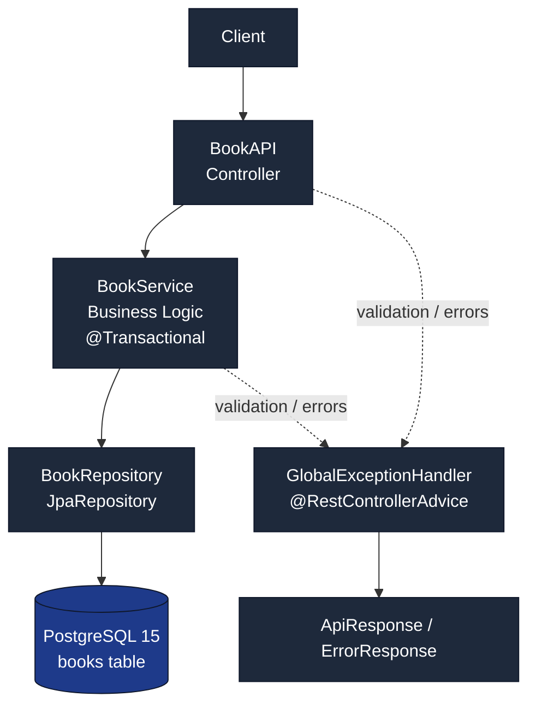

# Library API System


Library API System is a Spring Boot REST API for managing books with CRUD operations, search, pagination, sorting, range filtering, genre analytics, and statistics. It uses DTO-driven validation, centralized exception handling, and a Docker-first workflow backed by PostgreSQL 15.

## Table of Contents

* [Quick Start](https://github.com/kyledelfin2006/library-api-system#quick-start)
* [Architecture Overview](https://github.com/kyledelfin2006/library-api-system#architecture-overview)
* [File Structure](https://github.com/kyledelfin2006/library-api-system#file-structure)
* [Core Design Patterns](https://github.com/kyledelfin2006/library-api-system#core-design-patterns)
* [Key Features](https://github.com/kyledelfin2006/library-api-system#key-features)
* [Workflow & Lifecycle](https://github.com/kyledelfin2006/library-api-system#workflow--lifecycle)
* [Code Highlights](https://github.com/kyledelfin2006/library-api-system#code-highlights)
* [API Endpoints](https://github.com/kyledelfin2006/library-api-system#api-endpoints)
* [Setup & Installation](https://github.com/kyledelfin2006/library-api-system#setup--installation)
* [Troubleshooting](https://github.com/kyledelfin2006/library-api-system#troubleshooting)
* [Data Management](https://github.com/kyledelfin2006/library-api-system#data-management)
* [Upcoming Improvements](https://github.com/kyledelfin2006/library-api-system#upcoming-improvements)
* [License](https://github.com/kyledelfin2006/library-api-system#license)

## Architecture Overview

The application follows a clean layered architecture:

- `app.book.controller.BookAPI` handles HTTP requests and response mapping.
- `app.book.service.BookService` contains business logic and transaction boundaries.
- `app.book.repository.BookRepository` extends `JpaRepository` and handles persistence.
- `app.book.entity.Book` is the JPA entity mapped to the `books` table.
- `app.book.dto` contains request and response DTOs.
- `app.global.exceptions.GlobalExceptionHandler` centralizes API error handling.
- `app.auth.SecurityConfig` permits all requests and disables CSRF.



## File Structure

```text
src/main/java/app/
  LibraryApplication.java
  auth/
    SecurityConfig.java
  book/
    controller/
      BookAPI.java
    service/
      BookService.java
    repository/
      BookRepository.java
    entity/
      Book.java
    dto/
      BookRequestDTO.java
      BookResponseDTO.java
    exceptions/
      BookNotFoundException.java
  global/
    exceptions/
      GlobalExceptionHandler.java
    responses/
      ApiResponse.java
      ErrorResponse.java

src/main/resources/
  schema.sql

src/test/java/
  testAPI/
    BookTest.java
    BookServiceTest.java
```

## Core Design Patterns

- Layered architecture keeps HTTP, business, and persistence concerns separate.
- DTO-based request handling protects the entity model and keeps validation at the boundary.
- Transactional service methods rely on Hibernate dirty checking, so updates are flushed automatically when the managed entity changes.
- Centralized exception handling ensures consistent JSON failures across validation, not-found, database, and parsing errors.
- Repository abstraction through Spring Data JPA keeps persistence code small and testable.

## Key Features

- CRUD operations for books.
- Pagination and sorting through `GET /app/books/all` and `GET /app/books/sorted`.
- Advanced search by title, author, genre, or price.
- Price range filtering through `GET /app/books/price`.
- Statistics endpoint for total books, total library value, and the most expensive book.
- Genre distribution endpoint.
- Validation with `@Valid` on create and replace requests.
- Global handling for `BookNotFoundException`, validation errors, malformed JSON, number format errors, database issues, and unsupported methods.
- Open security configuration for local development and testing.

## Workflow & Lifecycle

### Request flow

1. The client sends an HTTP request to `/app/books`.
2. `BookAPI` maps the request and converts payloads into DTOs.
3. `BookService` performs business logic and validation.
4. `BookRepository` persists or reads data via Spring Data JPA.
5. PostgreSQL stores the data in the `books` table.
6. `GlobalExceptionHandler` formats failures into `ErrorResponse`.

### Update flow

1. The controller passes the incoming DTO to `BookService`.
2. The service loads the managed `Book` entity.
3. Field changes are applied to the managed entity.
4. Hibernate dirty checking detects the modifications.
5. The transaction commits and flushes the update without an explicit `save()` call for the update path.

### Startup flow

1. Spring Boot starts `app.LibraryApplication`.
2. `schema.sql` initializes the `books` table and indexes.
3. `SecurityConfig` allows all requests and disables CSRF.
4. The API becomes ready at `http://localhost:8080`.

## Code Highlights

### DTO validation on create

```java
@PostMapping("/addBook")
public ResponseEntity<ApiResponse<Book>> addBook(@Valid @RequestBody BookRequestDTO input) {
    Book newBook = manager.addBook(input);
    return ResponseEntity.status(HttpStatus.CREATED)
            .body(new ApiResponse<>(true, "Book Added Successfully", newBook));
}
```

### Partial updates with dirty checking

```java
@Transactional
public Book patchBook(Long id, BookRequestDTO updates) {
    Book existingBook = findBookById(id);
    if (hasText(updates.getTitle())) {
        existingBook.setTitle(updates.getTitle().trim());
    }
    if (updates.getPrice() != null) {
        if (updates.getPrice().compareTo(BigDecimal.ZERO) <= 0) {
            throw new IllegalArgumentException("Price must be greater than 0");
        }
        existingBook.setPrice(updates.getPrice());
    }
    return existingBook;
}
```

### Centralized API errors

```java
@ExceptionHandler(BookNotFoundException.class)
public ResponseEntity<ErrorResponse> handleBookNotFound(BookNotFoundException ex) {
    ErrorResponse error = new ErrorResponse("Book not found", ex.getMessage(), 404);
    return ResponseEntity.status(HttpStatus.NOT_FOUND).body(error);
}
```

## API Endpoints

| Method | Path | Description | Example Request | Example Response |
| --- | --- | --- | --- | --- |
| `GET` | `/app/books/health` | Health check for the API | `GET /app/books/health` | `{"success":true,"message":"API is running","timestamp":172...}` |
| `GET` | `/app/books/all` | Returns a paginated list of books | `GET /app/books/all?page=0&size=12&sort=id,asc` | `{"content":[{"id":1,"title":"1984","author":"George Orwell","genre":"Dystopian","price":19.99}],"pageable":{...}}` |
| `GET` | `/app/books/{id}` | Fetches a single book by ID | `GET /app/books/1` | `{"id":1,"title":"1984","author":"George Orwell","genre":"Dystopian","price":19.99}` |
| `POST` | `/app/books/addBook` | Creates a new book using `BookRequestDTO` validation | `POST /app/books/addBook` with `{"title":"1984","author":"George Orwell","genre":"Dystopian","price":19.99}` | `{"success":true,"message":"Book Added Successfully","data":{"id":1,"title":"1984","author":"George Orwell","genre":"Dystopian","price":19.99},"timestamp":172...}` |
| `PATCH` | `/app/books/{id}` | Partially updates a book | `PATCH /app/books/1` with `{"price":15.99}` | `{"success":true,"message":"Book updated successfully","data":{"id":1,"title":"1984","author":"George Orwell","genre":"Dystopian","price":15.99},"timestamp":172...}` |
| `PUT` | `/app/books/{id}` | Replaces a book completely | `PUT /app/books/1` with full DTO payload | `{"success":true,"message":"Book updated successfully","data":{"id":1,"title":"Animal Farm","author":"George Orwell","genre":"Political Satire","price":12.99},"timestamp":172...}` |
| `DELETE` | `/app/books/{id}` | Deletes a book by ID | `DELETE /app/books/1` | `{"success":true,"message":"Book deleted successfully","timestamp":172...}` |
| `GET` | `/app/books/search?type=title&value=orwell` | Searches by title, author, genre, or price | `GET /app/books/search?type=author&value=orwell` | `[{"id":1,"title":"1984","author":"George Orwell","genre":"Dystopian","price":19.99}]` |
| `GET` | `/app/books/budget?maxPrice=20` | Returns books priced at or below the given value | `GET /app/books/budget?maxPrice=20` | `[{"id":1,"title":"1984","author":"George Orwell","genre":"Dystopian","price":19.99}]` |
| `GET` | `/app/books/sorted?category=title` | Returns books sorted by title, author, genre, price, or id | `GET /app/books/sorted?category=price` | `[{"id":2,"title":"Animal Farm","author":"George Orwell","genre":"Political Satire","price":12.99}]` |
| `GET` | `/app/books/genre` | Returns genre distribution counts | `GET /app/books/genre` | `{"Fiction":3,"Fantasy":2,"Dystopian":1}` |
| `GET` | `/app/books/price?minPrice=10&maxPrice=25` | Returns books within a price range | `GET /app/books/price?minPrice=10&maxPrice=25` | `[{"id":1,"title":"1984","author":"George Orwell","genre":"Dystopian","price":19.99}]` |
| `GET` | `/app/books/stats` | Returns total books, total value, and the most expensive book | `GET /app/books/stats` | `{"totalBooks":6,"totalValue":123.45,"mostExpensiveBook":{"id":4,"title":"...","author":"...","genre":"...","price":49.99}}` |

## Setup & Installation

### Recommended: Docker

Docker is the preferred way to run the project because it brings up both PostgreSQL 15 and the Spring Boot application together.

1. Create your environment file from the example:
   ```bash
   copy .env.example .env
   ```
   Use values like:
   ```env
   POSTGRES_DB=librarydb
   POSTGRES_USER=admin
   POSTGRES_PASSWORD=change_me
   ```
2. Build the application jar:
   ```bash
   mvn clean package
   ```
3. Start the full stack:
   ```bash
   docker compose up --build
   ```
4. Open the API at `http://localhost:8080`.

### Local development

If you prefer to run the application directly on the host machine, start only PostgreSQL with Docker and then run Spring Boot locally.

1. Start the database:
   ```bash
   docker compose up db
   ```
2. Set the datasource environment variables:
   ```bash
   $env:SPRING_DATASOURCE_URL="jdbc:postgresql://localhost:5432/librarydb"
   $env:SPRING_DATASOURCE_USERNAME="admin"
   $env:SPRING_DATASOURCE_PASSWORD="change_me"
   ```
3. Run the app:
   ```bash
   mvn spring-boot:run
   ```

## Troubleshooting

| Symptom | Likely Cause | Fix |
| --- | --- | --- |
| App fails to start with datasource errors | Missing or incorrect `SPRING_DATASOURCE_*` variables | Check `.env` and Docker Compose values |
| `400 Bad Request` on create or replace | Validation failed in `BookRequestDTO` | Make sure `title`, `author`, `genre`, and `price` are valid |
| `Invalid JSON format in request body` | Malformed request payload | Send valid JSON and set `Content-Type: application/json` |
| `Book not found` | The requested ID does not exist | Verify the ID with `GET /app/books/all` |
| `Invalid Number Format` | Non-numeric values were sent to a numeric endpoint | Use numeric values for `price`, `minPrice`, `maxPrice`, and similar fields |
| `Method not allowed` | Wrong HTTP verb was used | Match the method listed in the endpoint table |
| Docker app container fails to start | The jar was not built before `docker compose up --build` | Run `mvn clean package` first |

## Quick Start

1. Copy `.env.example` to `.env` and fill in PostgreSQL credentials.
2. Run `mvn clean package`.
3. Run `docker compose up --build`.
4. Open `http://localhost:8080/app/books/health`.

## Data Management

- PostgreSQL 15 stores all book records.
- `src/main/resources/schema.sql` creates the `books` table and indexes.
- The app uses JPA and Hibernate for entity persistence.
- Updates rely on Hibernate dirty checking inside transactional service methods.
- `BookRequestDTO` is used for request validation, while `BookResponseDTO` is available for response shaping.

## Upcoming Improvements

- Add OpenAPI/Swagger documentation for interactive API discovery.
- Add controller-level integration tests alongside the existing unit tests.
- Introduce pagination options for more endpoints if the catalog grows.
- Expand search capabilities with more flexible filtering and sorting combinations.
- Add authentication and authorization if the API is exposed beyond local development.

## License

No license file is currently included in the repository. Add one if you plan to distribute or reuse this project.
